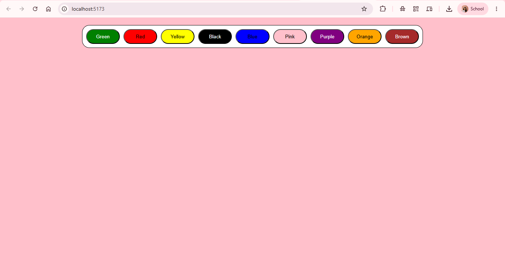

# 🎨 React Background Changer

A simple React.js application that allows users to change the background color of the page by clicking different color buttons.

## 🚀 Features

- 🎨 Instantly change the background color
- ⚛️ Built using React Functional Components
- 🪝 Uses the `useState` hook for state management
- 📱 Responsive and clean user interface
- ⚡ Fast and lightweight

## 🛠️ Technologies Used

- React.js
- JavaScript (ES6+)
- CSS3
- HTML5
- Vite

## 📂 Folder Structure

```
bg-changer/
│── public/
│── src/
│   ├── assets/
│   ├── App.jsx
│   ├── App.css
│   ├── index.css
│   └── main.jsx
│
├── index.html
├── package.json
├── vite.config.js
└── README.md
```

## ⚙️ Getting Started

### Clone the repository

```bash
git clone https://github.com/Wareesha-faheem/DevWeekends-Fellowship.git
```

### Navigate to the project

```bash
cd "React JS/bg-changer"
```

### Install dependencies

```bash
npm install
```

### Run the development server

```bash
npm run dev
```

The app will be available at:

```
http://localhost:5173
```

## 📚 Concepts Practiced

- React Components
- JSX
- useState Hook
- Event Handling
- Dynamic Styling
- Conditional Rendering

## 📸 Preview



## 🌱 Future Improvements

- 🎲 Random Color Generator
- 🎨 Custom Color Picker
- 📋 Copy HEX/RGB Color Code
- 💾 Save Favorite Colors
- 🌙 Dark & Light Theme Toggle
- ✨ Smooth Background Transitions

## 👩‍💻 Author

**Wareesha Faheem**

GitHub: https://github.com/Wareesha-faheem

---

⭐ If you like this project, don't forget to star the repository!
